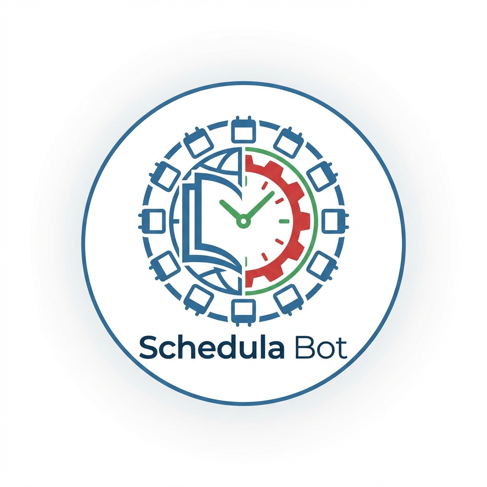

# 🤖 Schedula Bot (Wiki Club SATI)

**Schedula Bot** is the official telegram assistant for **Wiki Club SATI**, designed to help members schedule reminders, track events, and learn about Wikimedia projects.



## ✨ Features

| Command | Description |
|---------|-------------|
| `/start` | Welcome message & quick start guide |
| `/remind HH:MM message` | Set personal reminders (e.g., `/remind 14:00 Workshop`) |
| `/events` | View upcoming Wiki Club events |
| `/resources` | Wiki editing tutorials & guides |
| `/tip` | Random wiki editing tip |
| `/fact` | Fun Wikipedia fact |
| `/links` | Quick Wikimedia links |
| `/about` | About Wiki Club SATI |
| `/help` | List all commands |
| `/admin` | Admin dashboard (Admin only) |
| `/addevent` | Add new event (Admin only) |
| `/addresource` | Add resource (Admin only) |

## 🚀 Quick Start

### Local Development

```powershell
# Clone the repository
git clone https://github.com/YOUR_USERNAME/schedula-bot.git
cd schedula-bot

# Create virtual environment
python -m venv venv
venv\Scripts\activate  # Windows

# Install dependencies
pip install -r requirements.txt

# Set environment variable
$env:BOT_TOKEN = "your_bot_token_here"

# Run the bot
python bot.py
```

## ☁️ Deployment on Render

This bot is ready to be deployed on **Render** (Free Tier).

1. **Push to GitHub**: Push this code to a new GitHub repository.
2. **Create Web Service**: Go to [Render](https://render.com), create a new **Background Worker**.
3. **Connect Repo**: Select your GitHub repository.
4. **Environment Variables**: Add `BOT_TOKEN` in the Render dashboard.
5. **Deploy**: Click "Create Background Worker".

👉 **See [DEPLOYMENT.md](./DEPLOYMENT.md) for a detailed step-by-step guide.**

## 📁 Project Structure

```
schedula-bot/
├── bot.py              # Main bot code
├── config.py           # Configuration & branding
├── data/               # JSON data storage
│   ├── events.json     
│   ├── resources.json  
│   ├── tips.json       
│   ├── facts.json      
│   └── users.json      (Ignored in git)
├── assets/
│   └── schedulabot.png # Bot Profile Icon
├── requirements.txt
├── .gitignore
└── README.md
```

## ⚙️ Environment Variables

| Variable | Required | Description |
|----------|----------|-------------|
| `BOT_TOKEN` | ✅ Yes | Telegram Bot Token from @BotFather |
| `ADMIN_IDS` | ✅ Yes | Comma-separated Admin User IDs (e.g. `12345,67890`) |
| `TZ` | ❌ No | Timezone (default: Asia/Kolkata) |

## 🛡️ Admin Setup

To use admin commands like `/addevent`, follow these steps:

1. **Find your User ID**: Open Telegram and search for `@userinfobot`. Click `Start` to get your numeric ID (e.g., `123456789`).
2. **Configure ID**: Add your ID to the `ADMIN_IDS` environment variable.

## ☁️ Deployment

See [DEPLOYMENT.md](./DEPLOYMENT.md) for cloud deployment guide.

## 🔗 Links

- [Wiki Club SATI Meta Page](https://meta.wikimedia.org/wiki/Wiki_Club_SATI)
- [Wikipedia](https://www.wikipedia.org/)
- [Wikimedia Commons](https://commons.wikimedia.org/)

## 📄 License

This project is open source, promoting the Wikimedia mission of free knowledge.

---

*Made with ❤️ by lalit jindal | Promoting Open Knowledge 📚*
